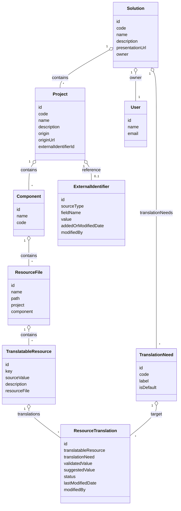

# Entity Diagram

## Main Entities

- Solution
- Project
- Component
- ResourceFile
- TranslatableResource
- ResourceTranslation
- TranslationNeed
- User
- ExternalIdentifier
- API Key

## Relationships

- A Solution contains multiple Projects
- A Project contains multiple Components
- A Component contains multiple ResourceFiles
- A ResourceFile contains multiple TranslatableResources
- A TranslatableResource can have multiple ResourceTranslations
- A TranslationNeed is linked to a Project/Component/ResourceFile
- A User can have different roles per Solution/Project
- An ExternalIdentifier can be linked to multiple Projects
- An API Key is associated with a User

## Diagram

