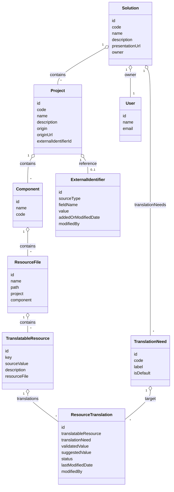

# Main Entity Diagram

> Convention: All entity, property, relation, table, column, API endpoint, method, and business object names are in English, as per the project's technical choices.

This diagram shows the structure of the main domain entities and their relationships.

