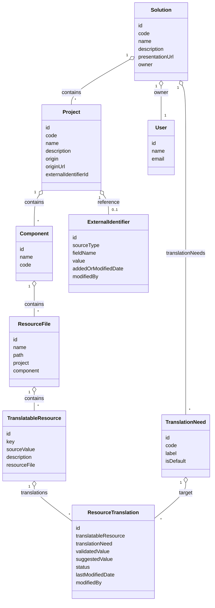

# Schéma des entités principales

> Convention : tous les noms d’entités, propriétés, relations, tables, colonnes, endpoints d’API, méthodes et objets métiers sont en anglais, conformément aux choix techniques du projet.

Ce diagramme présente la structure des entités principales du domaine et leurs relations.

